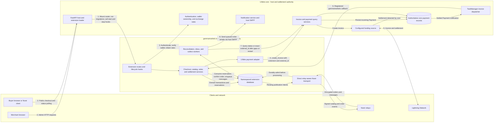

# gammamarkets — Technical Specification

**Status:** Corrected draft — ready for Phase 0 planning; implementation remains gated on Phase 0 acceptance
**Audience:** Implementers of the `gammamarkets` LNbits extension
**Companion document:** `gamma-native-python-extension-proposal.md` (architecture and rationale; this document is the normative build contract)
**Target host baseline:** LNbits `v1.6.2-rc1`, commit `e336fe1`; other versions require CI qualification
**Primary protocol:** GammaMarkets marketplace protocol, pinned to `market-spec` commit
`5dc79c5db0d41c0bea774debf445cce041192840` (2025-05-10)
**Protocol dependencies:** NIP-99, NIP-17, NIP-44 (v2), NIP-59, NIP-89; NIP-15/NIP-04 compatibility in Release C; NIP-37 deferred

The key words **MUST**, **MUST NOT**, **SHOULD**, and **MAY** are to be interpreted as
in RFC 2119. Where this specification and the pinned GammaMarkets draft conflict, the
conflict MUST be recorded in §21 (Decisions Register) rather than resolved silently.

---

## 1. Scope

This specification defines the complete build contract for the `gammamarkets` LNbits
extension:

- canonical domain model and persistence schema;
- Nostr event construction for Gamma/NIP-99 and NIP-15 compatibility output;
- NIP-17/NIP-04 order-message ingestion and response;
- order, inventory, payment, and publication state machines;
- HTTP API surface (admin, public, migration);
- merchant and customer order email notifications via the host SMTP transport;
- background-task behavior;
- key custody, encryption-at-rest, and security requirements;
- idempotency, reliability, and concurrency requirements;
- test and conformance requirements.

It does **not** define: LNbits core internals, relay implementations, UI visual design,
or the GammaMarkets protocol itself.

---

## 2. Pinned inputs

| Input | Pin |
|---|---|
| GammaMarkets market-spec | commit `5dc79c5` (`main` @ 2025-05-10) |
| Nostr NIPs | commit `a2494f4f81d46684e5814a9bf35e2b1df978f955` (2026-09-09); files 09, 15, 17, 32, 37, 42, 44, 59, 65, 89, 99 |
| NIP-15 status | draft/unrecommended — compatibility only |
| NIP-44 version | v2 payload only |
| Nostr library | Phase 0 candidate: host-resolved Python `nostr-sdk==0.44.8` from the pinned LNbits `uv.lock`; approval requires the qualification below |
| LNbits | `v1.6.2-rc1`, commit `e336fe1`, Python ≥3.10,<3.13 |

Phase 0 MUST copy the immutable protocol and host pins into `PINS.md`. Before
implementation, `PINS.md` MUST also record the approved Python SDK wheel filename and
SHA-256 for every supported platform, release-source revision, native Cargo dependency
revisions, supported installation/lockfile path, and executable security, FFI, and
per-relay ACK results. Version `0.44.8` is a candidate because the pinned host resolves
it, not a safety certification by version number. Version `0.44.5` MUST NOT be selected
unless an explicit spec decision demonstrates that the tested artifact contains or
otherwise mitigates fixes `02a88bd5688de058bfba8aa9fb4612441a384eff`,
`06f9b3f5dd7f6399249ff608189edfd98617c3a3`,
`b7f8894055b1223258109076cf34110e53695cef`, and
`fe4c30de618ba7c604777ab4b6863f4ab413a760`. The host MUST NOT be silently
downgraded. Any candidate other than the host-resolved `0.44.8` requires an explicit
spec decision and the same qualification. Source ancestry is evidence, not wheel or
runtime certification; independent pre-SDK bounds and signature validation remain
mandatory.

Pins are surfaced in the merchant settings UI. The GammaMarkets revision is emitted
only on public commerce events as defined in §6.8; it MUST NOT be added to encrypted-
message wrapper tags.

### 2.1 LNbits core integration architecture

The following diagram defines the host boundary and the runtime flow between LNbits core
and the `gammamarkets` extension. It shows only the core integration points on which this
specification relies; the internal LNbits implementation remains outside this contract.



Flow and ownership rules:

1. LNbits discovers the Python extension, mounts its `APIRouter`, runs its database
   migrations, and invokes `gammamarkets_start()`/`gammamarkets_stop()` for managed
   background work.
2. HTTP traffic enters through the LNbits FastAPI host. Merchant routes use LNbits
   authentication and wallet ownership checks; public checkout remains capability- and
   rate-limit constrained as specified in §5 and §15.
3. The extension owns catalog, inventory, reservation, order, inbox, outbox, and local
   payment-projection state in its namespaced database. It MUST NOT write LNbits core
   payment tables directly.
4. Invoice creation crosses the boundary only through the LNbits payment service with
   `extension="gammamarkets"` and `external_id="gammamarkets:<order.id>"`. LNbits core
   persists the authoritative incoming payment and delegates Lightning operations to the
   configured funding source.
5. Core dispatches settled `Payment` objects through `TaskManager`; the extension's named
   invoice listener validates extension, external id, wallet, amount, and metadata before
   atomically confirming the order (§8.3).
6. Reconciliation independently queries core payment state after startup, callback gaps,
   or uncertain invoice creation (§8.2 and §8.7). Nostr transport is extension-owned and
   reaches relays directly; relays never become authoritative for inventory or settlement.
7. Order email notifications are queued in `email_queue` and delivered by a leased worker
   through the host's configured SMTP transport (§8.8). The extension stores no SMTP or
   spend credentials and its code policy forbids outgoing-payment APIs; native host
   process privilege is nevertheless not a spend-capability sandbox (§8.3).

---

## 3. Definitions and identifier scheme

### 3.1 Internal identifiers

- Domain entity ids (`merchant`, catalog/product/order/outbox/etc.) are UUIDv4 hex
  generated server-side; natural-key support tables use the explicit composite keys in §4.
- All protocol-visible `d` tags are independent random identifiers, **not** the internal
  primary key, so that internal IDs never leak into public events.
- `d` tag alphabet: lowercase hex or `[a-z0-9-]` slugs; length 8–64 chars.
- Imported NIP-15 IDs are preserved as both Gamma `d_tag` and `nip15_product_id` only
  when they match the alphabet/length rule and do not collide. Otherwise generate a new
  Gamma `d_tag`; preserve the old NIP-15 id only if it is valid UTF-8, has no control or
  path-delimiter characters, is 1–128 bytes, and does not collide. Any replacement is
  explicit in migration preview and changes the corresponding protocol address.

### 3.2 Protocol addresses

```text
product:     30402:<merchant_pubkey>:<product_d>      (Gamma)
             30018:<merchant_pubkey>:<nip15_product_id> (same d for simple products;
                                                        composite id for variations)
collection:  30405:<merchant_pubkey>:<collection_d>
shipping:    30406:<merchant_pubkey>:<shipping_d>
stall:       30017:<merchant_pubkey>:<stall_d>        (one per catalog)
app rec:     31989:<merchant_pubkey>:30402
app info:    31990:<merchant_pubkey>:<handler_d>
```

### 3.3 Order identifiers

- `order.id` — internal UUIDv4, never exposed in Nostr traffic or public URLs.
- `order.external_id` — buyer-supplied `order` tag value for protocol orders; generated
  UUID for web. Reversible value is encrypted; equality uses domain-separated HMAC.
  Nostr uniqueness is `(merchant_id, buyer_pubkey_hash, external_id_hash)` across both
  protocols — see §14.
- `order.public_token` — 256-bit CSPRNG token for web orders, base64url-encoded and
  required for public status lookups. Stored as a SHA-256 hash, not in cleartext.

### 3.4 Money representation

- Product and shipping prices are stored as `(amount_minor: INTEGER, currency: TEXT,
  currency_decimals: INTEGER)`. ISO 4217 decimals; `decimals=0` for sat-denominated
  items, 2 for USD/EUR, etc.
- All computed order totals are stored in **satoshis** (`*_sat` columns, INTEGER ≥ 0).
- The host adapter calls uncached `btc_rates(currency)`. After a successful provider
  call it returns `FxQuote(currency, currency_per_btc, sat_per_major_unit, providers,`
  `observed_at, expires_at)`, where numeric values are `Decimal`, providers is nonempty,
  `sat_per_major_unit = Decimal(100_000_000) / currency_per_btc`, `observed_at` is the
  UTC completion time, and `expires_at = observed_at + 5 minutes`.
- Host floats are converted only at the adapter boundary with `Decimal(str(value))` and
  `currency_per_btc` is the Decimal arithmetic mean of the filtered provider values
  returned by `btc_rates`. Domain code MUST NOT call
  `fiat_amount_as_satoshis` or inherit its `int()` truncation. Empty, zero, nonfinite,
  failed, or stale results reject checkout before reservation.
- One `order_fx_quotes` row per source currency persists decimal-string values, provider
  names, direction/units, observed/expiry timestamps, and source. A singular order-level
  rate is insufficient for mixed-currency carts.
- Conversion is `amount_minor / 10**currency_decimals * sat_per_major_unit`, using
  `ROUND_CEILING` per line and per shipping component. Total is the checked integer sum.
  LNbits receives an integer sat amount. Phase 0 MUST measure and approve precision/error
  at the unavoidable host-float adapter boundary.

---

## 4. Persistence schema

All tables live in the extension's namespaced database. Types are given in portable
terms (`TEXT`, `INTEGER`, `BIGINT`, `BOOLEAN`, `TIMESTAMP`, `BLOB`) mapped to
SQLite/Postgres by the migration layer. `TIMESTAMP` values are UTC epoch seconds
unless noted. SQLite foreign-key enforcement MUST be enabled and tested. Domain/history
FKs use `ON DELETE RESTRICT`; catalog entities are soft-deleted so historical orders and
protocol tombstones remain valid. JSON fields are parsed into bounded typed models at
the boundary—never interpolated into SQL.

### 4.1 `merchants`

| column | type | notes |
|---|---|---|
| id | TEXT PK | internal UUID |
| user_id | TEXT NOT NULL | LNbits user id; UNIQUE |
| pubkey | TEXT NOT NULL UNIQUE | 64-hex schnorr pubkey |
| key_ref | TEXT NOT NULL | key-store handle, not key material |
| display_name | TEXT | |
| profile_json | TEXT | kind-0 profile fields |
| payment_preference | TEXT NOT NULL DEFAULT 'manual' | `manual` only in v1 |
| recommended_app_d | TEXT | random `d` for 31990; 31989 uses fixed `d="30402"` |
| wallet_id_enc / wallet_id_hash | BLOB/TEXT NOT NULL | encrypted LNbits wallet id + keyed lookup |
| notify_emails | TEXT | JSON array of ≤5 validated addresses for merchant alerts (§8.8) |
| notify_events | TEXT | JSON set of subscribed alert event types; default `order_received,confirmed,on_hold` |
| state | TEXT NOT NULL | `draft|publication_pending|active|deactivating|inactive` |
| created_at / updated_at | TIMESTAMP | |

- The decrypted `wallet_id` MUST belong to `user_id` and receive payments; validate on
  write and immediately before invoice creation. Changing/removing it is blocked while
  any order is `invoice_pending|awaiting_payment`. Existing payments keep wallet/source-
  wallet snapshots; ownership loss at settlement is a manual payment exception.

### 4.2 `catalogs`

`id` PK, `merchant_id` FK, `name`, `description`, `default_currency`,
`default_location`, `nip15_stall_d` (NULL until published), `publish_gamma` BOOL,
`publish_nip15` BOOL, `deleted_at`, `created_at`, `updated_at`.

### 4.3 `products`

| column | type | notes |
|---|---|---|
| id | TEXT PK | |
| merchant_id | TEXT NOT NULL FK | |
| catalog_id | TEXT NOT NULL FK | |
| d_tag | TEXT NOT NULL | UNIQUE(merchant_id, d_tag) |
| parent_product_id | TEXT NULL FK→products.id | variations only |
| product_type | TEXT NOT NULL | `simple`/`variable`/`variation` |
| format | TEXT NOT NULL | `digital`/`physical` |
| title / summary / description_md | TEXT | |
| amount_minor / currency / currency_decimals | | §3.4 |
| recurring_frequency | TEXT NULL | pinned Gamma unit `D|W|Y`; discovery-only in v1 |
| visibility | TEXT NOT NULL | `hidden`/`on-sale`/`pre-order` |
| nip99_status | TEXT NOT NULL | `active`/`sold` |
| draft | BOOLEAN NOT NULL DEFAULT false | local private draft; never published in v1 |
| stock_on_hand | INTEGER NULL | NULL = unlimited |
| stock_reserved | INTEGER NOT NULL DEFAULT 0 | |
| location / geohash | TEXT NULL | |
| weight_value / weight_unit | | ISO 80000-1 |
| dim_l / dim_w / dim_h / dim_unit | | |
| nip15_product_id | TEXT NULL | persisted id emitted as 30018 `d`/content `id` and accepted inbound; normally `d_tag`, composite/hash for variations (§6.6) |
| published_at | TIMESTAMP NULL | first 30402 publication |
| revision | INTEGER NOT NULL DEFAULT 0 | incremented on every mutation; feeds outbox |
| deleted_at | TIMESTAMP NULL | soft deletion; row retained for order snapshots and tombstones |
| created_at / updated_at | | |

Invariants (enforced by CHECK constraints where the DB allows, plus service-layer
assertion):

```text
amount_minor >= 0
currency matches ^[A-Z0-9]{3,8}$ and currency_decimals is 0..18
stock_on_hand IS NULL OR stock_on_hand >= 0
stock_reserved >= 0
stock_on_hand IS NULL OR stock_reserved <= stock_on_hand
product_type = 'variation' ⟺ parent_product_id IS NOT NULL
parent chain depth = 1 (a variation cannot be a parent)
```

### 4.4 Product detail tables

- `product_images` (product_id FK, url, dimensions, sort_order)
- `product_specs` (product_id FK, key, value)
- `product_categories` (product_id FK, category)
- `product_collections` (product_id FK, collection_id FK, UNIQUE pair)
- `product_shipping_options` (product_id FK, shipping_option_id FK,
  `extra_cost_minor` NULL, UNIQUE pair)
- `product_shipping_collections` (product_id FK, collection_id FK,
  `extra_cost_minor` NULL, UNIQUE pair)

The split tables avoid a polymorphic foreign key that a relational database cannot
enforce. v1 accepts only same-merchant options/collections. Gamma permits third-party
shipping events, but v1 cannot safely quote mutable third-party prices; those references
are rejected at import and publish boundaries. Inheritance is always explicit.

### 4.5 `collections`

`id` PK, `merchant_id` FK, `d_tag`, `title`, `description`, `image`, `location`,
`geohash`, `deleted_at`, `revision`, timestamps. UNIQUE(merchant_id, d_tag).

`collection_shipping` (collection_id FK, shipping_option_id FK) holds the options a
collection advertises; membership rows live in `product_collections`.

### 4.6 `shipping_options`

`id` PK, `merchant_id` FK, `d_tag` (UNIQUE per merchant), `title`, `description`,
`base_price_minor`, `currency`, `service` (`standard|express|overnight|pickup`),
`carrier`, `countries` (JSON array of ISO 3166-1 alpha-2), `regions` (JSON array of
ISO 3166-2), `duration_min`, `duration_max`, `duration_unit` (`H|D|W`),
`weight_min/_max` + unit, `dim_min/_max` (3 components + unit), `price_weight_minor`
+ `price_weight_unit`, `price_volume_minor` + `price_volume_unit`, `location`,
`geohash`, `active`, `deleted_at`, `revision`, timestamps. `price-distance` is not
supported in v1 because checkout does not geocode buyer addresses; importing or
publishing it MUST fail validation rather than silently charging zero.

### 4.7 `orders`

| column | notes |
|---|---|
| id PK | internal UUID |
| merchant_id FK | |
| buyer_pubkey_enc / buyer_pubkey_hash | encrypted reversible pubkey + domain-separated keyed lookup; NULL for web |
| protocol | `gamma`/`nip15`/`web` |
| external_id_enc / external_id_hash / request_hash | encrypted reversible id + keyed lookup; canonical immutable request hash |
| source_event_id | outer 1059 or kind-4 event id that created the order; NULL for web |
| currency | always `SAT`; source-currency quotes live in `order_fx_quotes` |
| subtotal_sat / shipping_sat / total_sat | merchant-computed, never buyer-supplied |
| buyer_amount_sat | the `amount` tag the buyer claimed, for audit/dispute display |
| state | §7.1 enum; includes `invoice_pending` saga state |
| shipping_state | §7.2 enum |
| contact_enc | encrypted email/phone JSON BLOB per §11.3 |
| address_enc | encrypted shipping address blob (§11.3); NULL for digital |
| shipping_option_id FK | NULL for digital/pickup-na |
| payment_hash | UNIQUE; set when invoice created |
| invoice_expiry | |
| public_token_hash / public_token_enc / public_token_expires_at | web-status bearer; hash for lookup plus protected encrypted copy for eligible delayed notification rendering; default expiry 30 days |
| checkout_scope_hash | privacy-key HMAC of the web client's admission scope for open-order quotas; NULL for protocol orders and never a raw IP |
| payment_exception / payment_exception_reason / payment_exception_resolution | exception flag, bounded code, and `unresolved|accepted|refund_requested|refund_confirmed` resolution |
| oversold | BOOLEAN — set when an exception-resolution `accept` exceeds stock |
| receipt_verified | BOOLEAN — buyer kind-17 receipt's bolt11+preimage checked against the settled payment (cosmetic only) |
| email_opt_in | BOOLEAN NOT NULL DEFAULT false | customer consented to transactional order emails (§8.8) |
| created_at / updated_at | |

`order_items` (order_id FK, product_id FK, product_d snapshot, title snapshot,
quantity, unit_price_minor, currency/currency_decimals snapshot, line_total_sat,
`backordered_qty` INTEGER DEFAULT 0 — portion accepted as oversold on
exception-resolution).
`order_events` (order_id FK, from_state, to_state, actor `merchant|buyer|system|nostr`,
detail_json, created_at) — append-only audit log containing identifiers/reasons only;
never PII, invoice/preimage material, or message plaintext. Every transition writes one
row in the same transaction.

`order_fx_quotes` (order_id FK, currency, rate_decimal TEXT, rate_direction,
rate_unit, source, quoted_at; UNIQUE(order_id, currency)).

`order_fulfillment` (order_id PK/FK, tracking_enc BLOB, carrier, eta, updated_at).
Tracking is bearer-like customer data and is encrypted at rest; it is shown only on the
authenticated merchant route, never the public-token status route.

`order_messages` (id PK, order_id FK NULL, direction `in|out`, protocol,
semantic_kind, sender_hash/recipient_hash, participant_keys_enc, rumor_id/event_id,
content_enc BLOB, created_at). General-message text and any structured payload needed for merchant history
is encrypted at rest and retained per §11.3.

### 4.8 `payments`

`id` PK, `order_id` FK UNIQUE, `core_external_id` TEXT UNIQUE, `payment_hash`
UNIQUE NULL, `checking_id_enc`, `bolt11_enc`, `wallet_refs_enc`, `wallet_id_hash`,
`source_wallet_id_hash`, `amount_sat`, `status`
(`creating|creation_unknown|pending|settled|expired|failed`), `settled_at`, `created_at`.
The extension inserts the projection with `status=creating` before invoking LNbits.
Payments are a local projection of LNbits core payments, not a second settlement
authority. `core_external_id = "gammamarkets:<order.id>"` MUST be passed to LNbits and
is the recovery key for the invoice saga independently of the commerce order state
(§8.2).

### 4.9 `inbox_events`

`id` PK, `outer_event_id` UNIQUE, `rumor_id` UNIQUE-where-present, `merchant_id` FK,
`source_relay_url`, `received_at`, `kind`, `author_hash`, `author_enc`,
`processed_state` (`received|validated|rejected|processed|quarantined`),
`reject_reason`, `raw_json` (bounded — see §15), `processed_at`. `source_relay_url` is
normalized provenance used for NIP-15 replies; it is never trusted as a NIP-17 fallback.

The inbox is a durable queue: events are persisted **before** processing so restarts
cannot lose them.

### 4.10 `outbox_events`

`id` PK, `merchant_id` FK, `aggregate_type`
(`product|collection|shipping|merchant|order_msg`), `aggregate_id`,
`aggregate_revision`, `event_kind`, `event_address` NULL, `payload_json`
(non-sensitive public intent) and `payload_enc` (private order-message descriptor),
never a long-lived signed event, `state`
(`pending|claimed|publishing|partially_published|published|superseded|failed`),
`attempts`, `next_attempt_at`, `claimed_by`, `claimed_at`, `claimed_until`, and
monotonically increasing `claim_token`, `last_error` (bounded diagnostic code—never
event content), `created_at`, `updated_at`. Every leased write compares the active
`claim_token`; an expired worker cannot commit after another claim.
`outbox_dependencies` (`outbox_event_id`, `depends_on_outbox_event_id`, UNIQUE pair)
expresses publication ordering.

`relay_publications`: `id` PK, `outbox_event_id` FK, `delivery_copy`
(`public|recipient|sender`), `relay_url`, `event_id`, `attempt_no`, `result`
(`accepted|rejected|timeout`), `message` (relay OK message, truncated to 512 chars),
`attempted_at`; UNIQUE(outbox_event_id, delivery_copy, relay_url, event_id,
attempt_no). NIP-17 recipient and sender copies have different event ids. Positive
`accepted` evidence is durable and successful copy/relay targets are never resent.

### 4.11 `relay_configs`, `peer_relays`, and `relay_cursors`

`relay_configs`: `id` PK, `merchant_id` FK (NULL = server-wide default), `relay_url`,
`direction` (`public|inbox|both`), `enabled`, timestamps. The kind-10050 discovered inbox
relays of *buyers* are cached in `peer_relays` (`pubkey_hash`, `pubkey_enc`, `relay_url`,
`fetched_at`, `expires_at`). Buyer keys/order ids are encrypted at rest; keyed HMAC
indexes permit lookup without deterministic encryption.

`relay_cursors`: `id` PK, `merchant_id` FK, normalized `relay_url`, `protocol`
(`nip17|nip15`), `last_completed_session_start`, `eose_session_id`, `eose_at`, and
`updated_at`; UNIQUE(merchant_id, relay_url, protocol). A cursor advances only after
EOSE and every event delivered before EOSE is durably admitted.

### 4.12 `inventory_reservations`

`id` PK, `product_id` FK, `order_id` FK, `quantity` INTEGER > 0, `state`
(`held|consumed|released|expired`), `expires_at`, timestamps. UNIQUE(order_id,
product_id). Only `held` contributes to `products.stock_reserved`.

### 4.13 `protocol_addresses`

`id` PK, `domain_type`, `domain_id`, `protocol`, `event_kind`, `author_pubkey`,
`d_tag`, `latest_event_id`, `latest_created_at`; UNIQUE(protocol, event_kind,
author_pubkey, d_tag). Use empty `d_tag` for non-addressable replaceable kind 0/10050
records. Rows survive soft deletion so tombstones can reference the latest event id.

### 4.14 `merchant_keys`

`merchant_id` PK/FK, `key_origin` (`generated|imported`), `key_version`, `nonce` BLOB,
`ciphertext` BLOB, `created_at`, `rotated_at`. The GCM authentication tag is included in `ciphertext`; AAD is defined
in §11.2. Raw nsecs never appear in `merchants`.

### 4.15 `idempotency_records`

`scope_hash` PK (SHA-256 of authenticated user id, or public merchant id, + method +
normalized route + idempotency key; IP is not part of idempotency identity),
`request_hash`, `state` (`in_progress|completed|failed`), `order_id` NULL, `owner_id`,
`lease_until`, `status_code`, `response_enc`, `created_at`, `expires_at`. First request
claims the row by unique insert before creating an order; concurrent copies wait/return
`409 request-in-progress`. A crashed lease is resumed through linked `order_id` and the
invoice saga, never restarted blindly. Key reuse with another hash is
`409 idempotency-conflict`. Public checkout requires a key. Token-bearing responses are
encrypted at rest.

### 4.16 `task_leases` and `rate_limit_buckets`

`task_leases`: `name` PK, `holder_id`, `fencing_token` monotonically increasing,
`leased_until`, `updated_at`. Every lease-protected write includes the current fencing
token so an expired worker cannot continue after a pause.

`rate_limit_buckets`: `scope_hash`, `bucket`, `window_start`, `count`, `expires_at`,
UNIQUE(scope_hash, bucket, window_start). Rate limits are database-backed so they
apply across workers. Raw IP addresses are never stored.

### 4.17 `settings` and `migration_jobs`

`settings`: key/value per merchant (e.g., `spec_revision`, feature toggles).
`migration_jobs`: `id`, `merchant_id`, `strategy`, `state`
(`preview|validated|executing|awaiting_cutover|done|aborted`), `manifest_json`,
`created_at`, `updated_at`.

### 4.18 `email_queue`

`id` PK, `merchant_id` FK, `order_id` FK NULL, `channel` (`merchant|customer`),
`event_type` (`order_received|confirmed|processing|shipped|delivered|cancelled|
expired|on_hold|refund_requested`), `recipient_enc` BLOB, `recipient_hash` TEXT,
`state` (`pending|claimed|sent|suppressed|failed`), `attempts`, `next_attempt_at`,
`claimed_by`, `claimed_at`, `claimed_until`, monotonically increasing `claim_token`,
`last_error` (bounded code only), `created_at`, `sent_at`.
UNIQUE(order_id, channel, event_type, recipient_hash) dedupes intent per recipient;
each merchant recipient has its own row. Every leased write compares `claim_token`.
The body is rendered at send time from a fixed template and current order state—no
rendered message or decrypted address is retained. Queue uniqueness does not guarantee
exactly-once SMTP delivery: a crash after SMTP acceptance but before commit may deliver
a duplicate. Sent rows keep metadata only and are pruned with §11.3 retention.

### 4.19 Indexes (minimum)

```text
products(merchant_id, catalog_id)        orders(merchant_id, state)
products(merchant_id, nip15_product_id) UNIQUE WHERE nip15_product_id IS NOT NULL
orders(payment_hash) UNIQUE              inbox_events(outer_event_id) UNIQUE
inbox_events(rumor_id) UNIQUE WHERE rumor_id IS NOT NULL
outbox_events(state, next_attempt_at)    outbox_events(aggregate_type, aggregate_id, aggregate_revision)
payments(order_id) UNIQUE                payments(payment_hash) UNIQUE
peer_relays(pubkey_hash)                 inventory_reservations(order_id, product_id) UNIQUE
orders(merchant_id, buyer_pubkey_hash, external_id_hash) UNIQUE WHERE buyer_pubkey_hash IS NOT NULL
orders(merchant_id, external_id_hash) UNIQUE WHERE protocol = 'web'
email_queue(state, next_attempt_at)         email_queue(order_id)
```

---

## 5. HTTP API surface

Base path: `/gammamarkets/api/v1`. Admin routes require
`Depends(check_user_exists)` and every repository query also scopes by the resolved
LNbits `user.id`/merchant id (defense in depth). Because `check_user_exists` accepts
header, cookie, and optionally user-id-only authentication, a second dependency on every
admin mutation MUST reject user-id-only auth and require either (a) an Authorization
bearer, or (b) cookie auth plus exact `Origin == GAMMAMARKETS_PUBLIC_BASE_URL` and a
per-session double-submit CSRF token. Missing/`null` origins fail cookie mutations.
The extension MUST NOT rely on host CORS, which may be permissive; origin/CSRF checks
are enforced at the route boundary. Production qualification MUST verify that host audit
middleware disables or redacts pre-route body/header capture for nsec import, checkout
PII, decrypted-order routes, and `X-Order-Token`. Public routes are unauthenticated and
database-rate-limited (§15).

### 5.1 Admin — merchant

```text
POST   /merchants                          create merchant (generates or imports key)
GET    /merchants/current                  current user's merchant + relay health summary
PATCH  /merchants/{id}                     profile, payment_preference, wallet_id, toggles
POST   /merchants/{id}/keys/import         body: {nsec} — over TLS only; see §11; request-body logging disabled
POST   /merchants/{id}/publish             enqueue republication of all aggregates
GET    /merchants/{id}/relay-health        per-relay connection/ACK summary
GET|PATCH /merchants/{id}/notifications    notify_emails + per-event toggles (§8.8)
POST   /merchants/{id}/notifications/test  send a test message to a configured address
DELETE /merchants/{id}                     begin two-step deactivation (§6.7); never destroys key before tombstones are durable
```

### 5.2 Admin — catalog

```text
GET|POST            /catalogs
GET|PATCH|DELETE    /catalogs/{id}
GET|POST            /products
GET|PATCH|DELETE    /products/{id}
POST                /products/{id}/images
GET|POST|PATCH|DELETE /collections[/{id}]
GET|POST|PATCH|DELETE /shipping[/{id}]
GET                 /products/{id}/events      dry-run: rendered unsigned events per protocol
DELETE is always a soft delete plus ordered reference removal and kind-5 tombstone per §6.7; draft/hidden are not deletion.
```

### 5.3 Admin — orders

```text
GET   /orders?state=&protocol=
GET   /orders/{id}                     full detail incl. decrypted address for owner
POST  /orders/{id}/status              body: {to_state} — must be a legal transition §7.1
POST  /orders/{id}/shipping            body: {shipping_state, tracking?, carrier?, eta?}
POST  /orders/{id}/cancel              merchant-initiated cancel with reason
POST  /orders/{id}/resolve-exception   body: {action: "accept"|"refund"|"confirm-refund", refund_reference?} — see §8.3
POST  /orders/{id}/public-token/reissue authenticated web-order token rotation; old token revoked immediately
GET   /orders/{id}/events              audit log
```

### 5.4 Public — catalog and checkout

```text
GET   /public/merchants/{pubkey}                    profile + preferences (no internals)
GET   /public/products/{merchant_pubkey}/{d_tag}    rendered listing + availability
GET   /public/collections/{merchant_pubkey}/{d_tag}
GET   /public/shipping/{merchant_pubkey}/{d_tag}
POST  /public/checkout
GET   /public/order-status                          token via X-Order-Token header
POST  /public/order-email-opt-out                   token via X-Order-Token; sets email_opt_in=false
GET   /p/{naddr}                                    NIP-89 handler for kind-30402 naddr
GET   /p/{merchant_pubkey}/{d_tag}                  canonical buyer-facing HTML product page
GET   /order                                        buyer order page; token is URL fragment only
```

The `naddr` handler decodes bech32, requires kind `30402`, a local merchant pubkey, and
a valid `d` identifier, and ignores embedded relay hints for server-side fetching. It
renders or redirects only to the local canonical product page; malformed, wrong-kind,
and foreign-merchant references fail without relay retrieval.

Buyer browsers poll `GET /public/order-status` with `X-Order-Token` every 5s until
a terminal/confirmed state. Bearer tokens MUST NOT appear in a request path or query.
The shareable magic link is `/gammamarkets/order#<token>`: URL fragments are not sent
to the server; page JavaScript reads and immediately removes the fragment with
`history.replaceState`, keeps the token in memory only, and sends it in the header.
The server sets `Referrer-Policy: no-referrer`; request/header logging MUST redact
`X-Order-Token`.

`POST /public/checkout` requires an `Idempotency-Key` header matching
`[A-Za-z0-9_-]{32,128}` and generated from ≥128 random bits; handling follows §4.15. Request:

```jsonc
{
  "merchant_pubkey": "<hex>",
  "items": [{"d_tag": "<product d>", "quantity": 1}],
  "shipping_option_d": "<d or null>",
  "address": {...},              // required iff any item is physical
  "email": "...", "phone": "...", // optional contact
  "email_opt_in": true           // opt in to order status emails; requires `email` (§8.8)
}
```

Response `201`:

```jsonc
{
  "public_token": "<256-bit token>",
  "order": {"state": "awaiting_payment", "total_sat": 12345,
            "bolt11": "lnbc…", "expires_at": 1730000000}
}
```

The public order endpoint MUST return only: state, shipping_state, total_sat, bolt11,
payment status, item summaries, and expiry. It does not return payment hash separately.
It MUST NOT return merchant internals, internal IDs, buyer address/contact echoes,
tracking numbers, or other orders' data.
Responses set `Cache-Control: no-store`, `Referrer-Policy: no-referrer`, and must not
be cached by a CDN. The HTML order page uses the same headers and a restrictive CSP
with no third-party scripts.

### 5.5 Migration

```text
POST  /import/nostrmarket/preview     body: {strategy: json|nostr, payload}
POST  /import/nostrmarket/execute     body: {job_id, confirmations:{…}}
GET   /import/{job_id}
POST  /import/{job_id}/cutover        final step; performs single-writer switch §13
```

### 5.6 Error model

All errors return RFC 9457 problem details:
`{"type": "urn:gammamarkets:<code>", "title": …, "status": …, "detail": …}`.
Defined codes include: `insufficient-stock`, `invalid-transition`,
`duplicate-order`, `wallet-mismatch`, `product-inactive`, `rate-limited`,
`invalid-shipping-destination`, `order-expired`, `unauthorized`.

---

## 6. Nostr event construction

All events are built **unsigned** from current domain state and signed immediately
before publication (§8.6). `created_at` is set at signing time. Tag ordering and decimal
serialization are deterministic (no scientific notation); event ids/signatures are
computed by the pinned SDK. On first publish, `product.published_at` is assigned once
in the same transaction that increments revision/enqueues outbox, so retries never
change it.

### 6.1 Product — kind 30402

```jsonc
{
  "kind": 30402,
  "content": "<description_md>",
  "tags": [
    ["d", "<product.d_tag>"],
    ["title", "<title>"],
    ["price", "<decimal amount>", "<CURRENCY>", "<freq?>"],   // required
    ["type", "<simple|variable|variation>", "<digital|physical>"],
    ["visibility", "<hidden|on-sale|pre-order>"],
    ["stock", "<max(0, on_hand - reserved)>"],                 // finite stock only
    ["summary", "<summary>"],
    ["published_at", "<first-publication unix seconds>"],
    ["image", "<url>", "<WxH or \"\">", "<sort?>"]*,           // per product_images
    ["spec", "<key>", "<value>"]*,
    ["weight", "<v>", "<unit>"]?,
    ["dim", "<l>x<w>x<h>", "<unit>"]?,
    ["location", "<string>"], ["g", "<geohash>"],
    ["t", "<category>"]*,
    ["a", "30402:<pubkey>:<parent d>"]?,                       // variations only, exactly one
    ["a", "30405:<pubkey>:<collection d>"]*,                   // explicit membership
    ["shipping_option", "30406:<pubkey>:<d>", "<extra-cost?>"]*,
    ["shipping_option", "30405:<pubkey>:<d>", "<extra-cost?>"]*// collection shipping refs
  ]
}
```

Rules:

- Every publicly published Gamma product MUST belong to at least one published 30405
  collection and emit the explicit collection `a` tag; this is this implementation's
  resolution of the pinned draft's required-vs-optional collection ambiguity.
- A `variation` product MUST emit exactly one `a` tag to its `variable` parent and MUST
  NOT itself be referenced as a parent.
- `stock` tag omitted when `stock_on_hand IS NULL` (unlimited).
- Products with `draft=true` MUST NOT produce a 30402; see §6.7 for draft handling.
- `visibility=hidden` products still publish (per spec, visibility is a display hint)
  but are excluded from the web catalog. A `hidden` product MUST still reject new
  public-checkout orders.
- When `available` reaches 0 the service SHOULD set `nip99_status=sold` (and restore
  `active` when stock is replenished) so NIP-99 clients reflect sellability; the
  `stock` tag alone is not a reliable sellability signal across clients.
- `sold` (`nip99_status`) emits `["status","sold"]`; active listings emit
  `["status","active"]`.
- The pinned Gamma draft uses `D|W|Y` frequency units while NIP-99 recommends noun
  forms (`day|week|year`). Gamma conformance is primary, so emit the Gamma unit and
  record this known compatibility divergence in `PINS.md`; do not invent duplicate
  `price` tags.

### 6.2 Collection — kind 30405

Required tags: `d`, `title`, one `a` per member product (`30402:<pubkey>:<d>`).
A collection with zero active member products MUST NOT be published because the pinned
Gamma profile requires product references. Optional: `image`, `summary` (first 280
chars of description), `location`, `g`, `shipping_option` → same-merchant `30406`
refs. Content = description markdown.

### 6.3 Shipping option — kind 30406

Required tags: `d`, `title`, `price` `[base_cost, currency]`, `country` (ISO 3166-1
alpha-2 list), `service`. Supported optional tags: `region`, `duration`
`[min,max,H|D|W]`, `carrier`, `location`, `g`, `weight-min/max`, `dim-min/max`,
`price-weight`, and `price-volume`. `price-distance` MUST be rejected in v1 because
checkout does not geocode buyer destinations.

Validation before publish: `service=pickup` requires `location` or `g`; constraint
min ≤ max; countries non-empty.

### 6.4 Merchant profile — kind 0

Standard profile content plus `["payment_preference", "manual"]` tag. `ecash`/`lud16`
MUST NOT be advertised in v1 (extension only honors `manual`).

Enabling the Release-B Gamma order channel requires 1–3 normalized `wss://` inbox
relays and publishes replaceable kind `10050` with one `["relay","wss://…"]` tag per
relay. Publish it to public discovery/write relays and inbox relays. Until a configured
discovery relay ACKs kind 10050, `gamma_orders_enabled=false` and the UI MUST NOT claim
NIP-17 reachability. Release-A web checkout activation does not require kind 10050.

### 6.5 Application handler pair — kinds 31989/31990

- `31990` (handler information): `d` = `merchant.recommended_app_d`; content is
  kind-0-style JSON describing the extension checkout; include `["k", "30402"]`
  and `["web", "<origin>/gammamarkets/p/<bech32>", "naddr"]`. The literal
  `<bech32>` placeholder is replaced by clients per NIP-89.
- `31989` (recommendation): `d` = **`"30402"`** (the supported event kind, not the
  app id); `a` tag = `["a", "31990:<merchant_pubkey>:<recommended_app_d>",
  "<relay-hint>", "web"]`.

Using the merchant key for both roles is the v1 decision (§21), but their `d` values
are intentionally different. Golden fixtures MUST catch this distinction.

### 6.6 NIP-15 compatibility events

**Stall 30017** — one per catalog; `d` = `catalog.nip15_stall_d`; content JSON:

```jsonc
{"id": "<stall_d>", "name": "<catalog.name>", "description": "<…>",
 "currency": "<default_currency>",
 "shipping": [{"id": "<opt_d>", "name": "<title>", "cost": <decimal>, "regions": […]}]}
```

**Product 30018** — event `d` and content `id` both equal
`product.nip15_product_id`; literal content JSON follows NIP-15:
`{"id":"<nip15_product_id>","stall_id":"<stall_d>","name":"…",`
`"description":"…","images":[],"currency":"USD","price":1.00,`
`"quantity":1,"specs":[["size","M"]],"shipping":[{"id":"<zone>","cost":0}]}`.
`specs` is an array of `[name,value]` pairs; `quantity` is an integer or `null` for
unlimited stock. Lossy rules (must be surfaced in UI preview):

- product in multiple collections → belongs to exactly one stall (its catalog's);
- variations → independent 30018; preferred id `<parent_d>-<variation_d>`. If that
  violates the NIP-15 id bound/collides, use `v-` + first 32 hex chars of
  SHA-256(length-prefixed parent d + variation d). Persist the chosen
  `nip15_product_id`; `specs` carry option values;
- Gamma countries and regions flatten into the NIP-15 zone `regions` array;
- `extra-cost` shipping → NIP-15 product `shipping[].cost` (per-unit surcharge); the
  stall zone keeps the base `cost` separately—do not add them together in the event;
- NIP-15 publication requires product and projected shipping currencies to equal the
  catalog/stall currency. Mismatches are a compatibility-preview error, not converted
  at volatile publication-time rates;
- a stall containing digital products includes a deterministic zero-cost `digital`
  shipping zone because NIP-15 orders must select one zone; digital products add no
  surcharge;
- `hidden`/`pre-order` → `quantity: 0`; NIP-15 has no interoperable visibility flag.

### 6.7 Deletion and drafts

- Product/collection/shipping removal is a soft delete and enqueues `kind:5` with
  `["a", "<address>"]` and `["k", "<kind>"]`; the protocol-address row is retained
  with the tombstone event id. A deletion request cannot guarantee erasure from all
  relays/clients and the UI MUST say so.
- Deleting a `shipping_option` or `collection` still referenced by products MUST be
  either rejected with a reference report or executed as an explicit strip-and-
  republish (merchant chooses); dangling `30406`/`30405` references are a defect.
  Removing a collection's last active product must also soft-delete/tombstone that
  collection or add a replacement member in the same domain transaction.
- Local drafts are private database records and are not published in v1. NIP-37
  cross-device draft sync is deferred: implementing it also requires kind-10013
  private-relay discovery, NIP-65 publication, expiration, and blank-content deletion.
  `draft=true` records MUST NOT produce 30402/30403 or appear in collections.
- Merchant deactivation is two-step and blocked while nonterminal orders or unresolved
  payment exceptions exist. (1) Mark `deactivating`, reject new orders, tombstone
  commerce and NIP-89 recommendation/handler events. Do **not** automatically delete
  kind-0 identity or kind-10050 DM preferences—they may be shared with other apps,
  especially after key import. (2) After ACKs or explicit override, mark inactive.
  Explicit key retirement may separately request deletion of extension-owned kind-0/
  10050 events; key deletion requires no pending outbox/private response work and occurs
  only after requested tombstones are durably published or explicitly abandoned.

### 6.8 Self-describing metadata

Public commerce events (30402/30405/30406 and optionally 30017/30018) carry a
Phase-0-selected reverse-domain NIP-32 namespace, for example
`["L", "org.gammamarkets.protocol"]` and
`["l", "5dc79c5", "org.gammamarkets.protocol"]`. Kind-0, NIP-89, NIP-04, seals,
and gift wraps MUST NOT receive these labels: they either have fixed metadata
semantics or the extra public tags would fingerprint private traffic. The exact
namespace is pinned in `PINS.md` before implementation.

### 6.9 Order messages (rumors)

All Gamma order traffic is NIP-17 gift-wrapped (kind 1059 → seal 13 → rumor).
Rumor `created_at` = real time; seal and gift-wrap timestamps are independently
randomized up to two days **in the past** per NIP-59. Seal tags MUST be empty and the
rumor MUST be unsigned.

For every outbound merchant rumor, the extension MUST create two independently sealed
and wrapped copies: one addressed to the buyer and one addressed to the merchant
(sender copy), using a fresh ephemeral wrapper key for each copy. The buyer copy goes
only to the buyer's kind-10050 relays; the sender copy goes only to the merchant's own
kind-10050 relays. Both copy results are tracked separately. This satisfies NIP-17
recovery semantics; local database storage is not a protocol substitute.

Every kind-16 rumor requires exactly one `p` recipient, one `subject`, one `type`, and
one `order` tag. Type-specific requirements below are additional; duplicate common tags
are rejected. Public NIP-32 labels MUST NOT be added to rumors, seals, or gift wraps.

**kind 16, type 1 — order creation (buyer→merchant)** — common tags plus `amount`
(sats) and `item` ×n
(`["item","30402:<pk>:<d>","<qty>"]`); optional `shipping`, `address`,
`email`, `phone`. This implementation additionally requires `country` and permits
`region` for physical orders (§8.1); web clients may encode the same fields in an
address JSON object. Inbound `subject` is required by the market-spec but the
extension tolerates its absence (empty) for lenient interop.

**kind 16, type 2 — payment request (merchant→buyer)** — `p` (buyer),
`subject="order-payment"`, `type=2`, `order`, `amount` = merchant-computed
total_sat, `["payment","lightning","<bolt11>"]`, `expiration`.

**kind 16, type 3 — status (both directions)** — `subject="order-info"`, `type=3`,
`order`, `status` ∈ {pending, confirmed, processing, completed, cancelled}. From a
buyer, only `cancelled` is actionable and only under §7.1; all other buyer statuses are
audit-only and cannot mutate merchant state. Inbound type-2 payment requests are
rejected in v1 because the merchant advertises manual/service-assisted mode.

**kind 16, type 4 — shipping (merchant→buyer)** — `subject="shipping-info"`,
`type=4`, `order`, `status` ∈ {processing, shipped, delivered, exception};
optional `tracking`, `carrier`, `eta`.

**kind 17 — receipt (buyer→merchant)** — `order`,
`["payment","lightning","<bolt11>","<preimage>"]`, `amount`. **Decision on
semantics:** a receipt is evidence, never a settlement trigger. On ingest:
match `order` and require sender keyed hash == order buyer hash; compare `bolt11`
to the order invoice and check `sha256(preimage) == payments.payment_hash` → if all match, set
`orders.receipt_verified=true` (cosmetic badge only); the receipt's `amount`
tag is stored in `order_events` as the buyer-*claimed* amount for dispute
display and is never reconciled against `total_sat` automatically.

**kind 14 — general DM** — stored encrypted and surfaced in merchant UI; optional
`subject` = order id. Thread only when the sender keyed hash matches the order's buyer
hash; otherwise leave unthreaded and reveal no order existence.

### 6.10 NIP-15 message compatibility (NIP-04 DMs)

| NIP-15 type | direction | literal content JSON shape |
|---|---|---|
| 0 order | buyer→merchant | `{"id":"<order>","type":0,"name":"…","address":"…","message":"…","contact":{"nostr":"…","email":"…","phone":"…"},"items":[{"product_id":"…","quantity":1}],"shipping_id":"<zone>"}` |
| 1 payment req | merchant→buyer | `{"id":"<order>","type":1,"message":"…","payment_options":[{"type":"ln","link":"<raw bolt11>"}]}` |
| 2 status | merchant→buyer | `{"id":"<order>","type":2,"message":"…","paid":true,"shipped":false}` |

The deterministic digital zone supports all-digital orders. Standard NIP-15 supplies an
opaque physical address, which cannot satisfy the machine-readable country/region
contract. Automatic physical checkout is accepted only when a separately specified and
validated machine-readable country/region extension is present. Ordinary opaque-address
physical orders are rejected before reservation with a type-2 status explanation;
Release C MUST NOT claim general NIP-15 physical-order compatibility.

NIP-04 (kind 4) is deprecated-insecure: accepted for compatibility, but the merchant
UI MUST label it "legacy / metadata-exposed". Apply the same pre-persistence size/rate
limits and outer id/signature verification as other inbound events, then decrypt through
the key store. Replies publish to the source relay plus configured NIP-15 public relays;
there is no private routing claim.

---

## 7. State machines

### 7.1 Order state

```text
received → rejected | invoice_pending | cancelled
invoice_pending → awaiting_payment | rejected | cancelled
awaiting_payment → confirmed | expired | cancelled
confirmed → processing | cancelled          (cancel after confirm = exceptional, needs reason)
processing → completed | cancelled
expired | cancelled → confirmed              (merchant-only verified late-settlement accept; §8.3)
completed, rejected → terminal
```

The exceptional `expired|cancelled → confirmed` transition is legal only when LNbits
shows a settled matching payment and an authenticated merchant chooses `accept`; it
must use the oversell/backorder procedure. No buyer message can invoke it.

`invoice_pending` is a durable saga boundary: stock is reserved, but no LNbits invoice
has yet been attached locally. An uncertain outcome sets the orthogonal
`payment_exception` flag while state remains `invoice_pending`.

- Legal transitions are enforced by a single `transition_order()` function used by
  every entry path (API, inbox, tasks). No code path may write `orders.state`
  directly.
- Buyer cancellation is honored only from `received|invoice_pending|awaiting_payment`;
  it atomically releases held reservations. A standard Lightning invoice generally
  cannot be revoked, so later payment follows §8.4.
- After `confirmed`, buyer cancellation is audit-only. Merchant cancellation requires
  an explicit reason and refund warning; it never implies money was returned.
- `payment_exception=true` is orthogonal to state: set for uncertain invoice creation,
  mismatched settlement, or payment after expiry/cancellation (§8.2–§8.4).

Gamma projection (for outbound type-3):
`received|invoice_pending|awaiting_payment→pending`, `confirmed→confirmed`, `processing→processing`,
`completed→completed`, `rejected|expired|cancelled→cancelled` + reason in content.

NIP-15 projection: `paid=true` iff a verified settled payment is attached and state
is `confirmed|processing|completed` (or merchant-cancelled after settlement);
`shipped=true` iff shipping_state ∈ {shipped, delivered}. Never compare enum ordering.

### 7.2 Shipping state

`not_required → pending → processing → shipped → delivered`; `exception` is reachable
from `processing|shipped`. Digital orders start and stay `not_required`. Recovery from
`exception` to `processing|shipped` requires an authenticated merchant action and a
bounded reason recorded in `order_events`.

### 7.3 Reservation state

`held → consumed | released | expired`. Only `held` reservations count in
`stock_reserved`. `consumed` is applied exactly once inside the settlement
transaction.

### 7.4 Outbox state

`pending|partially_published → claimed → publishing → published|pending|`
`partially_published|failed`. Zero positive ACKs return the row to `pending` with
backoff; an incomplete nonzero result returns it to `partially_published`; only exhausted
attempts or an explicit permanent policy enter `failed`. Public rows in
`pending|claimed|publishing|partially_published|failed` may become `superseded` when a
newer `aggregate_revision` exists for the same `(aggregate_type, aggregate_id,
event_kind)`. Order-message rows (`aggregate_type=order_msg`) MUST NOT be superseded.
A stale claim is reconstructed from durable positive `relay_publications` and returned
to `pending` or `partially_published` by a fencing-token compare-and-swap.

### 7.5 Inbox state

`received → validated → processed`; `→ rejected` (bad signature/shape, terminal);
`→ quarantined` (oversize/malformed/undecryptable, retained for inspection).

---

## 8. Core algorithms

### 8.1 Order intake (all protocols)

1. Parse and bound input (§15 limits). For protocol orders, `external_id` MUST
   match `^[A-Za-z0-9_-]{1,64}$`; anything else → reject/quarantine. Buyers can
   squat arbitrary order IDs within their own key — that is acceptable because
   uniqueness is scoped per buyer; the charset bound prevents injection and
   index abuse.
2. Resolve merchant; accept new orders only when `merchant.state=active`.
3. For Gamma orders, resolve and validate the buyer's kind 10050 before creating an
   order or reserving stock. A buyer who cannot receive the payment request is rejected
   immediately; source relay is not a fallback.
4. Resolve each `item` to a canonical product owned by that merchant; reject
   cross-merchant references. A NIP-15 order must contain products from one stall and a
   shipping id defined by that stall (the deterministic digital zone for all-digital
   orders). Gamma/web orders may span catalogs only when one selected shipping option
   validly covers all physical items. Order currency is **sats**; source currencies
   convert per §3.4 and mixed-currency carts are permitted.
5. Validate: only `on-sale` products are purchasable in v1; `hidden` and
   `pre-order` are discovery states only because v1 has no preorder cap/date/deposit
   model. Product must be non-draft, non-deleted, `nip99_status=active`, and have no
   `recurring_frequency` (v1 does not implement subscriptions); quantities ≥ 1; a
   `variable` parent is never directly purchasable — orders must
   name a `variation` or `simple` product; a `variation` is purchasable only while
   its parent is `variable` and itself `on-sale`.
6. Recalculate price from current domain state (§3.4). v1 requires `total_sat >= 1`
   because LNbits rejects amountless invoices; zero-priced listings are discovery-only.
   Buyer `amount` is stored as `buyer_amount_sat` and never trusted; if it differs,
   proceed with merchant total and note the difference in payment-request content.
7. If any item is physical, require one active same-merchant shipping option and a
   machine-readable destination country (ISO 3166-1 alpha-2) plus optional ISO 3166-2
   region. Web checkout supplies structured fields. The Gamma profile accepts either
   companion `country`/`region` tags or an `address` JSON object with those fields;
   opaque-address-only physical orders are rejected before reservation with a clear
   status message (this interop restriction belongs in `PINS.md`). Validate option
   coverage and constraints. Normalize weights/dimensions to one unit system; package
   weight/volume are sums across quantity, while each item's longest dimensions must
   satisfy dimension maxima. Shipping = one base charge + per-unit product extra costs
   + weight/volume surcharges; use checked Decimal/integer arithmetic and round each
   converted component up per §3.4. Never apply unsupported distance pricing.
8. Compute domain-separated keyed hashes and encrypt buyer pubkey/external id; insert
   `orders` (`received`), items, FX snapshots, and audit event in one transaction.
   UNIQUE(merchant_id, buyer_pubkey_hash, external_id_hash) deduplicates the same
   Nostr buyer across Gamma and NIP-15; on conflict, return the existing order only if
   its immutable item/quantity request hash matches, otherwise reject
   `duplicate-order-conflict`. For NIP-04, the event author MUST equal
   `contact.nostr` when that field is present; event author is always authoritative.

### 8.2 Reservation + invoice saga

Invoice creation is an external Lightning side effect and cannot share an atomic
transaction with the extension database. The implementation MUST use this recoverable
saga:

1. In one extension-DB transaction, conditionally claim every finite-stock item:

   ```sql
   UPDATE products SET stock_reserved = stock_reserved + :qty
   WHERE id = :pid AND deleted_at IS NULL
     AND (stock_on_hand IS NULL OR stock_on_hand - stock_reserved >= :qty)
   ```

   Lock products in sorted id order (avoids PostgreSQL deadlocks), enforce open-order
   caps, and transition the order with compare-and-swap `WHERE state='received'`.
   If any update/CAS rowcount != 1, roll back the entire transaction. Otherwise insert
   `held` reservations, insert the local payment projection with deterministic
   `core_external_id` and `status=creating`, and enter `invoice_pending`. Exactly one
   concurrent worker can win this transition.
2. Call LNbits `create_invoice` with the already revalidated merchant wallet,
   `amount=order.total_sat`, `currency="sat"`, `expiry=RESERVATION_TTL`,
   `extension="gammamarkets"`, `external_id="gammamarkets:<order.id>"`, and
   `extra={"tag":"gammamarkets","order_id":order.id}`. Memo MUST be generic
   (`"GammaMarkets order"`) and contain no buyer key, address, email, or external id.
3. In a second extension-DB transaction, attach a unique returned payment to the local
   projection regardless of whether the commerce state is now `invoice_pending` or
   `cancelled`; persist hash/checking id/BOLT11/actual expiry and wallet/source-wallet
   snapshots. If still `invoice_pending`, align reservation expiries, transition to
   `awaiting_payment`, and enqueue the payment request. If cancellation won, keep
   `cancelled`, do not deliver/return BOLT11 or enqueue a payment request, and retain the
   projection for late-settlement detection.
4. Cancellation from `received|invoice_pending|awaiting_payment` atomically releases
   held reservations exactly once. If LNbits definitively rejects creation, set the
   projection `failed`; release/reject only when the order remains `invoice_pending`,
   while a cancelled order stays cancelled. If the call times out or is unknown, set
   `status=creation_unknown` and `payment_exception=true`; **never automatically create
   a second invoice**.
5. Reconciliation selects local payment projections in `creating|creation_unknown` and
   queries LNbits by exact `core_external_id`, independent of `orders.state`. Exactly one
   match is attached using step 3. Zero matches after a five-minute uncertainty window
   marks the projection failed and releases/rejects only an `invoice_pending` order;
   `cancelled` remains cancelled. More than one match is a critical manual exception and
   none is delivered automatically.

The actual decoded BOLT11 expiry is authoritative for still-held reservations. This
closes the crash/cancellation window after LNbits persists an invoice but before the
extension persists its local projection. A settlement after cancellation follows the
payment-exception path and MUST NOT auto-reopen the order.

### 8.3 Settlement (LNbits invoice-paid event)

Trigger: `task_manager.register_invoice_listener(callback, name="gammamarkets")`
on every application worker. The callback first requires
`payment.extension == "gammamarkets"` and an exact
`payment.external_id == "gammamarkets:<UUID>"`; it then verifies wallet, order, amount,
and tag. It can attach a missing local payment projection (crash during §8.2 step 3)
before settlement. A payment matched only by buyer-controlled metadata is rejected.

One transaction:

1. Lock/conditionally update the payment and order rows using the dialect rules in
   §14. If already `settled` → no-op (idempotent).
2. Decode the stored/core BOLT11 and require its payment hash, integer amount, and
   expiry to match callback/core payment and local order. Compare wallet/source-wallet
   ids to the immutable payment snapshots and recheck that the merchant user still owns
   the wallet; ownership loss becomes a manual exception. Require incoming settled status and exact msat divisibility/amount; any mismatch sets
   `payment_exception`, emits a high-severity audit event, and does not confirm.
3. Mark the local payment settled and consume each `held` reservation → `consumed`;
   `stock_on_hand -= qty`,
   `stock_reserved -= qty`.
4. Transition order → `confirmed`; write `order_events` row.
5. Enqueue outbox intents: type-3 `confirmed` message (protocol orders), stock/state
   republication for affected products (new `aggregate_revision`).

If the order is `expired` or pre-payment `cancelled`: mark payment settled, set
`payment_exception=true`, DO NOT change state or consume reservations — merchant
resolves via `/resolve-exception`:

- `accept` → only after verified settlement, in one locked transaction decrement
  currently available finite stock (`stock_on_hand - stock_reserved`) without touching
  other buyers' reservations; unlimited stock needs no decrement. Record any shortfall
  in `order_items.backordered_qty`, set `orders.oversold=true`, transition to `confirmed`,
  and set resolution `accepted`/clear the exception. `stock_on_hand` never goes negative.
  For physical oversold orders, `shipping_state` becomes `processing`; digital orders
  remain `not_required`. The type-3 status MUST disclose the backorder. **Funds are
  accepted with disclosed oversell—the merchant owes fulfillment or a manual refund.**
- `refund` → the order stays terminal, `order_events` records `refund_requested`, and
  resolution becomes `refund_requested`; the exception remains open. v1 performs no
  automated outgoing payment. A separate authenticated `confirm-refund` action records
  a merchant-supplied non-secret reference and changes resolution to `refund_confirmed`/
  clears the exception without claiming that LNbits verified an outgoing refund.

Native Python extensions share the LNbits process and are not a spend-capability
sandbox. Runtime code MUST NOT call outgoing-payment APIs or retain admin/spend
credentials; this is a reviewed and tested policy, not an isolation guarantee.

### 8.4 Late payment

If invoice expires unpaid → expiry worker releases reservations (`expired`) and
transitions order `expired`, publishing type-3 `cancelled`. A subsequent settlement
follows §8.3's terminal-order branch. Under no code path may a late payment
auto-reopen the order.

### 8.5 NIP-17 ingest pipeline (inbox worker)

Transport admission first applies the raw-byte/tag limits and database-backed rate
limits in §15, requires kind 1059 with exactly one `p` tag equal to the target merchant,
and verifies the outer id/signature. Only then is the bounded outer ciphertext persisted
as `received`; invalid-signature floods increment a metric but do not fill the inbox
table. This is the durable handoff point.

For each admitted `inbox_events` row:

1. Recheck bounds; validate NIP-44's encoded minimum/version before base64 decode.
2. Dedupe `outer_event_id` by UNIQUE insert (a duplicate is a successful no-op).
3. NIP-44-decrypt outer content using the merchant private key and the outer ephemeral
   pubkey → seal; require kind 13 and empty tags.
4. Verify seal signature + id.
5. NIP-44-decrypt seal content using merchant key + `seal.pubkey` → rumor.
6. Require rumor id to equal the canonical NIP-01 hash, require it to be unsigned,
   and require `rumor.pubkey == seal.pubkey`. The outer key is never identity. Commit
   `processed_state=validated` before domain dispatch; reconciliation resumes this durable
   checkpoint without repeating admission.
7. If seal/rumor author is the merchant, accept only a rumor id already present in the
   outbound outbox/order-messages table, mark it as the recovered sender copy, and do
   not dispatch a domain command. This prevents the merchant's required self-wrap from
   being mistaken for an inbound buyer message.
8. Otherwise allow only rumor kind 14|16|17; validate tags per §6.9; require exactly
   one `p` equal to merchant pubkey. Every item address must carry merchant pubkey.
9. Dedupe `rumor_id`; insert/match order via §8.1.
10. Mark `processed`; authenticated but malformed/undecryptable rows become
   `quarantined` with a bounded reason and no plaintext. Quarantine/raw ciphertext is
   deleted after 30 days; processed ciphertext after 7 days, preserving only ids and
   audit metadata.

Buyer→merchant cancel (type 3 `cancelled`): apply only via §7.1 legality, keyed to
`order` tag + constant-time match of the sender keyed hash to
`order.buyer_pubkey_hash`.

### 8.6 Outbox publish algorithm

Worker loop:

1. Atomically claim up to N rows where `state IN ('pending','partially_published')`,
   `next_attempt_at<=db_now`, and `attempts<MAX_ATTEMPTS`, setting worker id,
   `claimed_until`, incremented `claim_token`, and `state=claimed`. PostgreSQL uses
   `FOR UPDATE SKIP LOCKED`; single-worker SQLite uses `BEGIN IMMEDIATE` plus a bounded
   select/update. Every later write compares `claim_token`; claim behavior has dialect
   integration tests (§14).
2. Claim only rows whose dependencies are published. If a newer revision exists for a
   supersedable aggregate, mark the old row `superseded`; dependent rows are rebound
   to the current replacement intent or rebuilt—never treated as satisfied by stale
   content.
3. Build unsigned event(s) from **current** domain state (not stale payload) for
   catalog aggregates. An `order_msg` row stores an encrypted-at-rest descriptor with
   a fixed rumor `created_at`, canonical rumor id, recipient, and semantic payload;
   retries reuse the same rumor id but create fresh seal/wrapper timestamps, keys,
   ciphertexts, and outer event ids. Receivers dedupe retry wraps by rumor id.
4. Sign via key store (§11). Public addressable events use
   `created_at=max(db_now, latest_created_at+1)` only if that timestamp is not in the
   future beyond configured tolerance; otherwise pause and alert clock health rather
   than publishing an event relays may reject or treat as older. Construct both NIP-17
   delivery copies per §6.9.
5. Resolve target relays: public set for catalog events; recipient and merchant
   kind-10050 sets for the two gift wraps (§9.3).
6. Publish; record one `relay_publications` row per copy and relay.
7. A future/old-timestamp relay rejection is not "fixed" by backdating and creating a
   competing addressable event. Record it, pause that target, and surface host/relay
   clock health. NIP-59 wrapper timestamps are independently randomized in the past.
8. Outcome policy:
   - public event: `published` after the configured quorum (default ≥1 positive OK);
   - NIP-17 message: `published` only after ≥1 recipient-copy positive OK **and** ≥1
     sender-copy positive OK;
   - accepted copy/relay targets recorded in `relay_publications` are never resent;
   - any result with at least one positive OK but an incomplete quorum returns to
     `partially_published` with backoff and retries only missing targets; private retries
     retain the canonical rumor id but use fresh
     seals, wrappers, timestamps, and outer event ids;
   - zero positive OKs returns to `pending` with backoff; after `MAX_ATTEMPTS`, mark
     `failed` and surface it. WebSocket send success alone is never delivery evidence.

Backoff: `min(2^attempts * 5s, 30min) + jitter(0–5s)`. `MAX_ATTEMPTS` = 20.
After lease expiry, reconstruct durable accepted targets and return a stale claim to
`pending` or `partially_published` only with a claim-token CAS.

Publication ordering is explicit: supporting 30406 → 30405 → 30402; NIP-15 stall
30017 → product 30018. Gamma collection↔product references are inherently circular,
so initial publication accepts a brief eventual-consistency window by publishing the
collection first, then product. Membership/reference changes enqueue every affected
collection and product. Deletion first republishes surviving aggregates without the
reference, then publishes the kind-5 tombstone.

### 8.7 Reconciliation (startup + periodic 60s)

- For each `payments.status=pending`: query LNbits payment status; if settled → §8.3;
  if expired → expiry path.
- For each payment projection in `creating|creation_unknown`, query LNbits core by exact
  `core_external_id` and apply §8.2 step 5 regardless of the commerce order state.
- Resume committed `received` orders by idempotently beginning §8.2; never abandon an
  order merely because a crash occurred between intake and reservation.
- Reclaim stale outbox rows only with compare-and-swap on old claim token/lease and
  reconstruction from durable positive relay results.
- Reprocess admitted inbox rows left `received|validated`.
- Expire reservations for `awaiting_payment` and unresolved `invoice_pending` only
  under §8.2/§8.4 rules.
- If an `awaiting_payment` order has a local payment but no type-2 outbox row, enqueue
  it idempotently; if web, make BOLT11 available to the token-gated status route.
- Detect multiple LNbits payments with one core external id and quarantine the order.

This covers crashes between reservation, invoice persistence, local projection,
callback delivery, and outbox enqueue.

### 8.8 Email notification worker

Email is best-effort and never blocks an order transition. Enqueue points:

- §8.1 order insert → merchant `order_received` alert.
- §8.3 settlement → `confirmed` to merchant, and a single combined "order placed and
  paid" email to the opted-in customer containing the order summary and the
  `/gammamarkets/order#<token>` status link. Customer sends omit `order_received` —
  placed and paid are one event; an oversold `accept` resolution adds `on_hold` with
  the backorder disclosure.
- Admin status/shipping/cancel transitions → `processing`, `shipped`, `delivered`,
  `cancelled`; `resolve-exception {refund}` → `refund_requested`; any
  `payment_exception` flag → `on_hold`.
- §8.4 expiry → `expired`.

Send path:

1. Claim rows like §8.6 (`FOR UPDATE SKIP LOCKED` / `BEGIN IMMEDIATE`) with
   `claimed_until` and an incremented `claim_token`; every write compares that token.
2. Mark `suppressed`, not `sent`, without calling SMTP when host SMTP is not configured
   (`settings.is_email_notifications_configured()` false), the merchant disabled the
   event type, or a customer row's `email_opt_in` was revoked.
3. Render the plaintext template. Subjects carry only the merchant display name and
   event name—never a buyer name, address, email, pubkey, or internal order id. Bodies
   may include item summaries, `total_sat`, state, and the public status link. The link
   uses the protected encrypted `public_token`; this is inherent to the magic-link
   design and is disclosed in §19/§21.
4. Deliver via `lnbits.core.services.notifications.send_email` (host
   `lnbits_email_notifications_*` transport, STARTTLS). The extension MUST NOT store
   SMTP credentials or accept a merchant-supplied relay host in v1.
5. The host boundary exposes only classified success (`True`) versus unclassified
   failure (`False` or exception). Only `True` enters `sent`. Every failure returns to
   `pending` with `min(2^attempts * 30s, 4h) + jitter`; after
   `EMAIL_MAX_ATTEMPTS` (default 5), enter `failed` and surface it. v1 MUST NOT claim it
   distinguishes transient transport errors from SMTP 5xx recipient rejection.
6. Rate-limit before claim via `rate_limit_buckets` keyed on `recipient_hash` and
   merchant id—never the raw address (§15).

Email MUST NOT carry decrypted addresses, private keys, payment secrets, or full
BOLT11/preimage material (payments correlate by `payment_hash` only). Customer sends
are strictly opt-in per order and transactional only — no marketing use, no remote
images or tracking pixels, no attachments. The public order page exposes an opt-out
action that sets `email_opt_in=false` and cancels queued customer rows for that order.

---

## 9. Nostr transport

### 9.1 Interface

```python
class NostrTransport(Protocol):
    async def publish(self, event: SignedEvent, relay_urls: list[str]) -> list[RelayResult]
    async def subscribe(self, name: str, filters: list[Filter],
                        on_event: Callable[[Event], Awaitable[None]]) -> None
    async def close_subscription(self, name: str) -> None
    async def health(self) -> dict[str, RelayHealth]
```

**v1 baseline—direct transport.** The implementation uses a qualified `nostr-sdk`
client with per-purpose connection pools (public versus per-recipient inbox). The
checked-out `nostrclient` may inform lifecycle/reconnection code and may become an
optional public-catalog adapter only after it exposes per-publication target sets,
positive relay OK results, merchant-scoped authorization, and the same `NostrTransport`
contract. Its current fan-out API cannot route NIP-17 and it is not a hard dependency.
A `nostrrelay` extension is another possible adapter candidate, but no checkout/API was
available during contract correction, so this specification makes no capability claim.
Every adapter MUST pass identical targeted routing and ACK tests.

Deterministic local accepting, rejecting, and silent relays are authoritative Phase 0
tests. `wss://nostr.net` is an operator-approved optional external public-relay smoke
target using an ephemeral test key and non-sensitive synthetic event. It is not a
production default, not an assumed NIP-17 inbox, and its availability or result cannot
replace deterministic tests.

### 9.2 Subscriptions

Per merchant with Gamma orders enabled, subscribe on its kind-10050 inbox set:

```text
{ "kinds": [1059], "#p": [merchant_pubkey], "since": <cursor> }
```

When NIP-15 compatibility is enabled, subscribe separately on configured NIP-15 public
relays (and record source relay for replies):

```text
{ "kinds": [4], "#p": [merchant_pubkey], "since": <cursor> }
```

**Cursor rule:** NIP-59 randomizes the outer 1059 `created_at` (up to ~2 days of
skew), so `since` MUST NOT be derived from last-processed event timestamps.
For each relay, `since = last_completed_session_start − 3 days`; on first use default
to 30 days back (operator-configurable). Persist a new session start only after EOSE
has been handled and all events delivered before EOSE are durably admitted. A crash
before EOSE leaves the prior cursor intact. The cursor is session time—not event time—
and event-id dedup absorbs overlap.

### 9.3 Peer inbox relays (kind 10050)

Before sending a buyer copy, resolve the buyer's latest valid kind 10050 from multiple
configured discovery relays, requiring a valid signature and 1–3 normalized relay tags;
cache it for at most 24h. Sender copies use the merchant's configured/published kind-10050
set. Gift wraps MUST be published only to the respective recipient's listed relays.

**No-route policy:** NIP-17 says absence of kind 10050 means the recipient is not ready
and clients should not try. There is no fallback or opt-out from this rule. No valid
buyer 10050 → row stays `pending` with `last_error='no_inbox_relays'`; refresh every
15 min for 48h, then `failed`. Publishing to arbitrary public/merchant relays would
violate NIP-17 and publicly expose the receiver's identity, even though the ephemeral
outer key does not reveal the sender. Gamma order-channel activation cannot complete
without the merchant's own valid kind-10050 configuration. Release-B production-ready
mode requires at least one inbox relay verified (by integration test/operator policy) to
use NIP-42 and serve 1059 only to the authenticated p-tagged recipient. Other/open relays
are labeled degraded because they expose recipient metadata and amplify anonymous spam.

### 9.4 NIP-42

If a relay requires AUTH, authenticate with the merchant key via key store signing;
auth challenges are untrusted, bounded to 1 KiB, and signed only when the relay URL
exactly matches the active connection. AUTH never authorizes a different origin.

### 9.5 Relay URL and egress security

Relay URLs are server-side connection targets and therefore an SSRF boundary. All
configured/discovered URLs MUST be canonical `wss://` URLs with no userinfo, fragment,
or Unicode-confusable hostname; default port 443 unless operator policy allows another.
Resolve every address and reject loopback, private, link-local, multicast, reserved,
unspecified, and metadata-service ranges for IPv4 and IPv6. Revalidate on reconnect and
redirect (redirects disabled by default). Raw IP relay URLs are rejected.

DNS prevalidation alone is vulnerable to rebinding because the SDK performs its own
resolution. Production readiness therefore also requires an OS/container egress policy
blocking private/control-plane ranges. If the deployment cannot enforce that policy,
merchant-configured public relays may be limited to an operator allowlist and arbitrary
buyer kind-10050 relays MUST be disabled; Release B conformance cannot be claimed.
Connection count, handshake time, frame size, idle time, and per-host concurrency are
bounded. Never log relay AUTH challenges or complete sensitive event payloads.

---

## 10. Background tasks

`gammamarkets_start()` performs only synchronous, bounded registration through
`task_manager.create_permanent_task(func, name="gammamarkets.<task>")` and stores the
returned Task handles; it performs no network or reconciliation work inline. Checkout
and relay subscriptions stay disabled behind a readiness gate until a startup
reconciliation task completes. `gammamarkets_stop()` calls
`task_manager.cancel_task(handle)` for only those handles (including the registered
invoice listener) and closes SDK clients/subscriptions; calling
`task_manager.cancel_all_tasks()` is forbidden. Every task and SDK client MUST use
cancellation-safe `finally` cleanup because process shutdown may cancel tasks without
invoking the extension stop hook. The stop hook handles dynamic disable but is not
assumed on every process exit.

| task | cadence | lease | purpose |
|---|---|---|---|
| `relay_manager` | event-driven + 30s health tick | yes | connect/reconnect pools, restore subs |
| `inbox_processor` | 1s/drain | yes | §8.5 durable inbox processing |
| `outbox_publisher` | 5s | no global singleton; row claims fence work | §8.6 |
| `email_sender` | 5s | no global singleton; row claims fence work | §8.8 |
| invoice callback | LNbits event | registered on every worker, no lease | §8.3; DB idempotency absorbs duplicates |
| `reservation_expiry` | 30s | yes | release expired reservations |
| `reconciliation` | before relay start + 60s | yes | §8.7 |
| `retention_pruner` | daily | yes | §8.5/§11.3 retention |

A lease-protected loop acquires/renews `task_leases` with database time and a fencing
token; loss of lease stops work immediately. Every loop has bounded batches, structured
logs (ids/states only), and per-unit exception isolation. `create_permanent_task`
restarts the loop after uncaught failure, but durable rows—not memory queues—provide
recovery.

---

## 11. Key custody and cryptography

### 11.1 `MerchantKeyStore` interface

```python
generate(merchant_id) -> pubkey
import_key(merchant_id, nsec_bech32) -> pubkey
public_key(merchant_id) -> pubkey
sign_event(merchant_id, event_dict) -> signed_event
nip17_wrap(merchant_id, unsigned_rumor, recipient_pubkey) -> signed_gift_wrap
nip17_unwrap(merchant_id, signed_gift_wrap) -> unsigned_rumor
nip04_decrypt(merchant_id, peer_pubkey, ciphertext) -> bytes   # legacy compat
nip04_encrypt(merchant_id, peer_pubkey, plaintext) -> bytes    # NIP-15 replies
delete(merchant_id)
rewrap(old_version, new_version)
```

Application services MUST NOT receive raw private keys or raw conversation keys.
`nip17_wrap` is called once per delivery copy and owns ephemeral wrapper-key generation,
independent past-timestamp randomization, seal signing, and NIP-44 operations. All
cryptographic methods validate input lengths before allocation/decode.

### 11.2 Local key backend (v1)

- Merchant nsec stored in `merchant_keys`, encrypted with AES-256-GCM as
  `key_version + random 96-bit nonce + ciphertext_with_tag` using LNbits' existing
  `pycryptodomex` dependency (or another approved audited AEAD already in the host).
- Operator provides a versioned keyring through a secret source:
  `GAMMAMARKETS_MASTER_KEYS={"v1":"<32-byte base64>","v2":"…"}` and
  `GAMMAMARKETS_ACTIVE_KEY_VERSION=v2`. Configuration is parsed strictly; missing,
  duplicate, short, or malformed keys fail startup before merchant services activate.
- AAD is unambiguous length-prefixed encoding of
  `"gammamarkets"`, merchant/record id, table, column, and key version — preventing
  cross-record ciphertext transplant and concatenation ambiguity.
- Rotation is resumable: new writes use active version; a maintenance job rewraps rows
  in bounded transactions while old+new keys are present; old key removal is blocked
  until a full scan finds zero old-version rows and a backup/restore drill passes.
- NIP-44 v2 and NIP-59 implemented **only** through `nostr-sdk` primitives; no custom
  secp256k1/chacha code.
- Decrypted keys/messages/addresses are never logged or returned publicly. Raw nsecs
  are not cached in application services or attached to long-lived SDK clients; decrypt
  only inside a key-store operation and release references promptly. Python cannot
  guarantee physical memory zeroization, which is documented as residual risk.

### 11.3 Sensitive-field encryption at rest

`orders.address_enc`, `orders.contact_enc`, `order_messages.content_enc`,
`outbox_events.payload_enc`, `order_fulfillment.tracking_enc`,
`orders.public_token_enc`, `email_queue.recipient_enc`, encrypted idempotency
responses, participant/external/wallet identifiers, BOLT11/checking ids, and any retained
decrypted rumor use the same AES-256-GCM envelope with per-record/field AAD. The inbox
stores outer ciphertext only by default; plaintext exists only during bounded processing.

Equality indexes use HMAC-SHA256 under `GAMMAMARKETS_PRIVACY_KEY` over
length-prefixed purpose + merchant id + normalized value (`buyer-pubkey`, `order-id`,
`wallet-id`, `source-wallet-id`, `client-ip`, `email-recipient` are distinct purposes). The key is backed up like the master key. Rotation
requires dual-index columns/read support, a complete reindex from encrypted values, and
only then removal of the old index/key; changing it in place is forbidden.

Default retention: processed inbox ciphertext 7 days, quarantine 30 days, order PII and
message plaintext 90 days after terminal order state, then cryptographic erasure of those
fields while financial totals/audit identifiers remain. Merchants MAY shorten retention;
extending it requires an explicit policy setting. Backups inherit the same sensitivity
and retention cannot guarantee immediate removal from old backups.

### 11.4 Public tokens

`public_token` = 256 random bits encoded base64url. Store SHA-256(token bytes) for
lookup and compare with `hmac.compare_digest`; reject malformed/noncanonical encodings
before lookup. Store a separate AEAD-encrypted copy only while the token is valid and an
opted-in delayed notification may need to render the magic link. It is never plaintext at
rest or logged. Rotation/revocation immediately invalidates the old hash and erases the
encrypted copy; expiry does the same. Tokens are returned once at checkout, may be
replayed from protected idempotency storage, and may be reissued only by authenticated
merchant action. Default expiry remains 30 days.

---

## 12. Configuration

| setting | default | notes |
|---|---|---|
| `GAMMAMARKETS_MASTER_KEYS` / `GAMMAMARKETS_ACTIVE_KEY_VERSION` | — | required versioned keyring (§11.2) |
| `GAMMAMARKETS_PUBLIC_BASE_URL` | — | required canonical HTTPS origin; never derived from Host/Forwarded headers |
| `GAMMAMARKETS_PRIVACY_KEY` | — | required stable 32-byte secret for equality indexes/IP pseudonyms; separate from encryption keys |
| `RESERVATION_TTL` | 900s | requested invoice expiry; decoded BOLT11 expiry wins |
| `OUTBOX_MAX_ATTEMPTS` | 20 | |
| `OUTBOX_BATCH` | 32 | rows per claim |
| `PEER_RELAY_TTL` | 24h | kind-10050 cache |
| `INBOX_MAX_EVENT_BYTES` | 32768 | pre-decode cap |
| `CHECKOUT_RATE_LIMIT` | 10/min/IP | §15 |
| `GAMMAMARKETS_EMAIL_ENABLED` | true | effective only when host `is_email_notifications_configured()`; extension holds no SMTP credentials (§8.8) |
| `EMAIL_MAX_ATTEMPTS` | 5 | per-queue-row retry bound |
| `SPEC_REVISION` | `5dc79c5` | shown in settings UI |

---

## 13. Migration from `nostrmarket`

1. **Preview** accepts authenticated local JSON (10 MiB maximum) or validated Nostr
   events; it never fetches a user-supplied URL/path or opens another extension database
   by arbitrary name. Build `{stalls, products, zones, quantities, ids, keys: pubkey-only}`.
   Treat all fields as untrusted; private keys are never in the catalog path.
2. **Execute** imports using §3.1's id-preservation/mapping rules. Any collision or
   invalid legacy id is explicit in the manifest; unresolved conflicts block execution.
3. **Dry run** renders all 30402/30405/30406/30017/30018 events and runs §6
   validators + golden fixture harness.
4. **Inventory-authority cutover (every key strategy):** freeze new old-system order
   intake, then inventory every old nonterminal order and still-payable invoice. The
   existing `nostrmarket` active toggle helps freeze new structured orders but does not
   neutralize invoices already issued. For each product, either wait/reconcile every
   liability or reserve/partition equivalent units as `legacy_liability_qty` before
   fixing imported available stock. The signed cutover manifest records each liability,
   product mapping, partition, and operator confirmation; a new key alone is not safe.
5. **Cutover:** after liabilities are accounted, flip publish flags and enqueue
   aggregates. Old settlement handling remains active for already-issued invoices while
   new old-system orders remain disabled. Expired/released liability stock transfers to
   gammamarkets only through an audited inventory adjustment. Parallel operation is
   allowed only for explicitly partitioned inventory. External software cannot be
   detected; same-key reuse remains an additional operational trust boundary.

---

## 14. Idempotency, transactions, and multi-worker behavior

- Idempotency uses UNIQUE constraints (§4.19) plus `idempotency_records`, never
  check-then-insert. Public checkout requires `Idempotency-Key`; admin mutations accept
  it and SHOULD send one. Same key + different body is `409`, not replay.
- Canonical request hashing uses method + normalized route + canonical JSON body; scope
  binds authenticated user or public merchant, independent of rotating network identity.
  Public keys must match `[A-Za-z0-9_-]{32,128}` and be generated from ≥128 random bits.
  Records expire after
  24h except checkout records, retained through invoice expiry + 24h.
- LNbits' `Connection.execute/insert/update` helpers auto-commit. A small extension
  transaction adapter MUST use one `Database.connect()` context and raw parameterized
  SQLAlchemy calls only. PostgreSQL uses `async with conn.conn.begin()` and schema-
  qualified extension tables. SQLite executes `BEGIN IMMEDIATE`, raw statements, then
  explicit commit/rollback. Calling LNbits' auto-committing wrapper methods inside a
  domain transaction is forbidden and tested.
- SQLite support is single LNbits process/worker only. PostgreSQL supports multiple workers with
  row locking/`SKIP LOCKED` or atomic compare-and-swap. CockroachDB and multi-process
  SQLite are not v1 production targets. Startup MUST fail or prominently refuse
  production-ready mode for unsupported topology.
- Task leases use database time, short renewal, and fencing tokens (§4.16). Outbox claims
  are dialect-specific—not a supposedly portable `UPDATE … IN (SELECT …)`—and include
  lease expiry + compare-and-swap. No in-process lock protects cross-request state.
- The invoice saga (§8.2) deliberately spans transactions; each local state mutation is
  atomic and external uncertainty is reconciled, never described as rollback-able.
- Reconciliation acquires its lease and completes a startup pass before relay
  subscriptions and checkout activation.

---

## 15. Limits and rate limiting

| input | bound |
|---|---|
| raw inbox event JSON | 32 KB (pre-decode) |
| rumor content | 8 KB post-decrypt |
| tags per event | ≤ 128; tag element ≤ 2 KB |
| items per order | ≤ 64; qty per item ≤ 10,000 and merchant-configurable lower cap |
| computed amount | checked signed 64-bit; > LNbits incoming-payment maximum rejected |
| title/summary/description | ≤ 200 / 500 / 64 KB |
| images per product | ≤ 16; URL scheme `https` only; no server-side fetch |
| checkout POST | 10/min/IP + 100/hour/IP |
| open (unpaid) web orders per IP | ≤ 10 concurrent |
| open orders per buyer_pubkey per merchant | ≤ 10 concurrent |
| held reservations per product | ≤ 100 concurrent rows; total held quantity ≤ `stock_on_hand` for finite stock |
| public GETs | 120/min/IP |
| order DMs per authenticated inner buyer | 20/hour, excess rejected |
| admitted gift wraps per merchant/relay | 300/min and queue depth 1,000; excess counted/dropped before decrypt |
| customer order emails | ≤ 1 per event type per order (UNIQUE) and ≤ 8/hour per `recipient_hash` |
| merchant alert emails | ≤ 60/hour per merchant; test sends ≤ 5/hour |

**Stock-squatting decision:** TTL and per-IP/pubkey caps bound duration and database
amplification but do **not** prevent a distributed attacker from reserving all scarce
stock. This denial-of-inventory risk is accepted for v1 and disclosed to merchants;
merchants can disable public web checkout or lower TTL/quantity caps. Do not claim the
per-product row-count cap prevents stock denial. Proof-of-work/deposit defenses require
a later protocol/product decision.

NIP-59 outer keys are one-time, so buyer limits apply only after successful unwrap and
cannot stop pre-decryption spam. Relay/merchant admission caps, bounded workers, and
recipient-gated NIP-42 inbox relays are mandatory controls; overload metrics/alerts make
dropped wraps visible. NIP-13 proof-of-work MAY be added later but is not required for
interop in v1.

IP scopes use domain-separated HMAC-SHA256 with the privacy key, never raw/unsalted
IP hashes. Time windows live in bucket keys; rotating the HMAC daily would break
concurrent-open-order caps. Client IP comes from the socket peer unless LNbits trusts the
immediate reverse proxy; arbitrary `X-Forwarded-For` is ignored.

Markdown uses an allowlist sanitizer—no raw HTML or `javascript:`/`data:` URLs. Images
are never server-fetched in v1 (avoids SSRF); browser rendering uses HTTPS only,
`referrerpolicy=no-referrer`, lazy loading, and CSP `img-src https:`. Merchants and
buyers are warned that remote image hosts still learn viewer IP/time. Admin and order
pages load no third-party scripts.

---

## 16. Observability

- Structured logs: `event=gammamarkets.<component>.<action>` with ids/states; never
  keys, addresses, bolt11 strings in full (truncate to `payment_hash` correlation),
  or decrypted content.
- Metrics hooks: outbox depth/age, inbox depth, relay health per merchant,
  reservation count, stuck orders, failed publications.
- Merchant dashboard: per-relay status, outbox table, payment exceptions queue.

---

## 17. Test requirements

- **Golden fixtures** for every event in §6—valid/invalid—including NIP-89's fixed
  31989 `d=30402`, NIP-15 stall `cost`, exact decimal/tag ordering, NIP-59 sender copy,
  malformed signatures, missing tags, oversized values, and duplicates.
- **Host/SDK contract tests:** pinned LNbits `create_invoice` persists extension/external
  id and source wallet; task start/stop cancels only extension handles; transaction
  adapter does not auto-commit; pinned Python SDK wraps/unwraps NIP-59 and exposes
  per-relay acceptance rather than send-only success.
- **State-machine tests:** exhaustive legal/illegal transition table for §7.1–7.5.
- **Concurrency tests:** parallel reservations, duplicate checkout/idempotency races,
  duplicate settlement callbacks, cross-protocol order replay, and duplicate gift wraps
  including the merchant's own sender copy.
- **Security tests:** invalid outer/seal signatures, rumor/seal mismatch, NIP-44 MAC
  failure and pre-decode bombs, cross-merchant refs, CSRF, idempotency conflicts,
  token leakage/guessing, public amount manipulation, replayed payments, relay SSRF
  (IPv4/IPv6/DNS rebinding), task lease fencing, and log scrubbing.
- **Interop:** at least one external Gamma client + one NIP-15 client exercised in
  manual conformance runs; results recorded per release.
- **Failure drills:** kill at every §8.2 saga boundary; kill between settlement and
  callback; lose a task lease mid-write; relay outage/partial ACK; rotate encryption
  master key and restore backup. Each recovers without duplicate invoice, stock
  decrement, or message semantics.

---

## 18. Release gates

- **Release A** (Gamma/NIP-99 catalog + web checkout): 30402/30405/30406, kind-0,
  NIP-89, web checkout, invoice saga, inventory, outbox, key custody, and hardening.
  Excludes NIP-17/NIP-04 and MUST NOT claim Gamma order-protocol support.
- **Release B** (full Gamma merchant): kind-10050 publication/discovery, NIP-17
  sender+receiver copies, type 1–4 messages, kind-17 receipts, egress controls, and
  external-client conformance.
- **Release C** (interop): NIP-15 30017/30018, NIP-04 order channel, and migration.

---

## 19. Threat model summary

Assets and controls per proposal §21; the normative requirements here:

- **Keys:** §11 envelope encryption; no plaintext persistence; no key material in
  API responses, logs, exceptions, or browser storage.
- **Payments:** LNbits state authoritative; receipts are hints; amount always
  server-computed; wallet ownership revalidated per invoice.
- **Inbound Nostr:** everything untrusted; verify-before-decrypt-before-dispatch
  order in §8.5 is mandatory; sizes bounded before decode.
- **Public API:** token-gated order views; rate limits; server-side totals;
  cross-merchant references rejected by FK + explicit check.
- **Privacy:** buyer address/contact/tracking/messages encrypted at rest with bounded
  retention; tokens never in HTTP paths; NIP-04 labeled legacy; separate NIP-17 sender
  and recipient wraps go only to each party's declared relays.
- **Network:** relay targets are an SSRF boundary requiring URL validation plus egress
  enforcement (§9.5); remote product images remain a disclosed viewer-IP risk.
- **Concurrency/failure:** invoice creation is a reconciled saga; DB transitions use
  real transactions and fencing; unsupported multi-worker topology cannot claim ready.
- **Email:** host-SMTP only; no extension-held credentials or merchant-supplied relay
  hosts. Subjects carry no PII; customer sends are per-order opt-in with token-gated
  opt-out. The status link is a bearer token — email compromise grants read-only
  order visibility, disclosed in §21.

---

## 20. Traceability

Each section maps to proposal build phases: §4–§9 → Phases 1–3; §8.5/§9.3 → Phase 4;
§8.2–8.4/8.7 → Phase 5; §6.6/6.10 → Phases 6–7; §13 → Phase 8; §15–§17 → Phase 9.

---

## 21. Decisions register

Previously-open design questions, resolved. Each decision is normative for v1;
revisit only through a spec revision.

1. **Order-id authority.** `external_id` is buyer-chosen and isolated across
   buyers because uniqueness is scoped by keyed
   `(merchant_id, buyer_pubkey_hash, external_id_hash)` across Gamma/NIP-15. Charset bound `^[A-Za-z0-9_-]{1,64}$` prevents injection/index
   abuse (§8.1). A buyer can only squat IDs against themselves — accepted.
2. **kind-17 receipt `amount`.** Buyer-claimed amount, stored for dispute display
   only. Receipt validity = `bolt11` match + `sha256(preimage) == payment_hash`;
   verified receipts set a cosmetic `receipt_verified` flag (§6.9).
3. **Refund path and host privilege.** v1 implements no automated outgoing payment.
   `refund` records a request and `confirm-refund` records merchant attestation after an
   out-of-band wallet-UI refund (§8.3). A native extension shares host privilege, so this
   is an enforced code policy and review gate—not a spend-capability sandbox.
4. **`stock` tag truthfulness.** Publish `available` (`on_hand − reserved`); the
   reservation-volume leak is accepted — it is accurate sellable stock, which is
   what buyers need. No hysteresis in v1.
5. **Merchants per user.** 1:1 (`UNIQUE(user_id)`) for v1. Multi-shop is a
   documented future schema change, not supported now.
6. **NIP-89 handler identity.** The merchant key signs both 31989 and 31990 —
   the extension's web checkout *is* the merchant's recommended application. A
   distinct app identity is rejected for v1: it adds a second key with no
   interoperability benefit.
7. **`payment_preference`.** Always `manual` in v1. The 31989/31990 pair is
   published at merchant activation once a wallet is configured, so service-
   assisted buyers are directed to the web checkout per the market-spec's
   manual+recommended-app flow.
8. **Relay clock skew.** Public addressable timestamps are monotonic and not
   backdated on rejection. Clock-invalid publication pauses and surfaces a health
   failure; competing older events are never created (§8.6).
9. **Shipping `extra-cost` currency.** `extra-cost` is denominated in the
   product's currency per the market-spec; the shipping option's own `price`
   currency is independent. At order time every component (line items, option
   base, extra-cost, weight/volume surcharges) is converted to sats
   individually per §3.4 — currencies are never mixed arithmetically.
10. **NIP-15 `product_id` round-trip.** Inbound NIP-15 orders carry the
    flattened `nip15_product_id` (§4.3), stored per product; §8.1 resolves
    `item.product_id` via that column. Simple products normally use `d_tag`; variations
    use the persisted composite-or-hash id rule emitted in 30018 (§6.6).
11. **NIP-17 routing and history.** No relay fallback is allowed without recipient
    kind 10050. Every outbound rumor has separate buyer and merchant sender copies,
    each routed only to that party's declared relays (§6.9/§9.3).
12. **Invoice atomicity.** Lightning invoice creation is a saga, not a DB transaction.
    Exact LNbits `external_id` correlation recovers the post-create crash window and
    unknown outcomes never auto-create a second invoice (§8.2).
13. **Drafts.** v1 drafts are local/private only. NIP-37 is deferred because correct
    support includes kind 10013, NIP-65 write relays, expiration, and deletion (§6.7).
14. **Preorders and subscriptions.** They may be published for discovery but are not
    purchasable in v1; billing/backorder policy requires a future design (§8.1).
15. **Database topology.** v1 supports SQLite only as a single process and PostgreSQL
    for multi-worker production. CockroachDB/multi-process SQLite are not claimed (§14).
16. **Relay SSRF.** App-layer URL/DNS checks are necessary but insufficient; production
    Release B requires private-range egress blocking or an operator-only allowlist (§9.5).
17. **Public order bearer.** Tokens never appear in HTTP paths/queries. Shareable links
    use a URL fragment removed immediately; API requests use a redacted header (§5.4).
18. **Third-party shipping.** Rejected in v1 because mutable third-party pricing cannot
    be quoted authoritatively; only same-merchant FK-backed references are accepted.
19. **Migration single-writer.** A new key is identity separation, not inventory
    separation. Every migration freezes old intake and reconciles or partitions every
    still-payable inventory liability before imported stock becomes sellable (§13).
20. **Collection ambiguity.** Every published product belongs to at least one 30405
    collection, satisfying the pinned Gamma required-component interpretation (§6.1).
21. **Email transport.** v1 uses host SMTP and interprets `send_email` only as boolean
    success versus unclassified failure. False/exception retries with a bound; it does
    not invent transient-versus-5xx classification (§8.8).
22. **Email bearer link.** Order status emails reuse
    `/gammamarkets/order#<token>`. A protected encrypted token copy exists only for its
    valid notification lifetime; hash lookup, revocation, and erasure remain authoritative
    (§8.8/§11.4). Queue uniqueness dedupes intent, not SMTP delivery.
23. **SDK qualification.** Host-resolved `nostr-sdk==0.44.8` is the Phase 0 candidate,
    not an approved artifact. `PINS.md` freezes platform hashes, native provenance and
    executable security/FFI/ACK results; no silent host downgrade is allowed (§2).
24. **Cancellation race.** The payment projection and deterministic external id survive
    cancellation. A returned or discovered invoice is attached for settlement detection
    but never delivered and never reopens a cancelled order (§7.1/§8.2).
25. **Runtime name.** Package, extension id, routes, hooks, environment variables,
    payment correlation, and encryption AAD are frozen as `gammamarkets` before the
    first migration or publication.
26. **Transport adapters.** Qualified direct `nostr-sdk` is the baseline. `nostrclient`
    and an uninspected `nostrrelay` are optional candidates only after satisfying the same
    target-routing, positive-ACK, and authorization contract (§9.1).
27. **External relay smoke test.** `wss://nostr.net` may receive only an ephemeral,
    non-sensitive Phase 0 smoke event. It is neither a production default nor a substitute
    for deterministic local accepting/rejecting/silent relay tests (§9.1).
28. **FX boundary.** Uncached host provider results cross one explicit float-to-Decimal
    adapter; all aggregation, units, freshness, persistence and ceiling conversion are
    extension-owned and tested (§3.4).
29. **Host lifecycle/security.** Start is bounded registration; readiness follows startup
    reconciliation. Cleanup is cancellation-safe, route auth does not trust host CORS,
    and audit redaction is a deployment qualification predicate (§5/§10).

---

## 22. OpenGSD implementation-readiness gate

**Assessment: ready for OpenGSD initialization and Phase 0 planning; not ready for
production runtime implementation until Phase 0 acceptance passes.** Runtime code belongs
in the separate `gammamarkets` repository, not this proposal site. Phase 0 builds isolated
host/SDK probes, protocol fixtures, and executable state/schema models—not the production
extension.

| ID | Required Phase 0 acceptance |
|---|---|
| P0-01 pins | Resolve/import the approved host and SDK set on every claimed platform; record wheel/native hashes, source provenance and lockfile path; no silent downgrade or unapproved pin change. |
| P0-02 SDK security | Repeated invalid/known-ID events never enter trusted processing; paused-signing AUTH bursts remain bounded; oversized NIP-44 input is rejected before full decode/allocation. Record the tested binary. |
| P0-03 host contract | A fake funding backend proves invoice extension/external-id metadata, wallet correlation, exact lookup, listener registration, owned-handle cancellation and the absence of a durable callback-delivery promise. |
| P0-04 relay ACK | Local accepting, rejecting and silent relays produce positive OK, negative OK and timeout without sending to unlisted relays. The optional `wss://nostr.net` smoke event is non-authoritative. |
| P0-05 encrypted fixtures | Fixed kind-16 recipient/sender copies preserve rumor id across retry, use independent wrappers, route only to party relays and reject tampered outer/seal/rumor chains without logging plaintext. |
| P0-06 transactions/fencing | Concurrent last-unit buyers yield one reservation; stale fenced writes fail; rollback is complete; host auto-commit helpers never split a domain transaction; SQLite FK enforcement works. Run SQLite and claimed PostgreSQL profiles. |
| P0-07 cancellation race | Pause invoice creation; cancel from every allowed state; return success, timeout and settlement; restart. Stock releases once, correlation survives, cancelled never reopens, BOLT11 is not delivered, and no second invoice is created. |
| P0-08 recovery closure | Restart at every order/inbox/outbox checkpoint including partial copies. Every row resumes or terminates explicitly; only missing targets retry; canonical rumor and ACK evidence survive. |
| P0-09 email persistence | Two merchant recipients, revoked customer consent and confirmation delayed beyond idempotency retention prove per-recipient dedupe and protected token expiry/revocation without plaintext persistence or hash reversal. |
| P0-10 SMTP boundary | Success, `False`, exception and recipient rejection stubs prove only `True` is sent; all failures use bounded unclassified retry and no logs expose recipient PII or bearer links. |
| P0-11 NIP-89 route | A valid 30402 naddr resolves locally; malformed, wrong-kind and foreign references fail; relay hints never trigger an unvalidated fetch. |
| P0-12 auth/privacy/lifecycle | ID-only and cross-origin cookie mutations fail; approved bearer/CSRF paths pass; audit capture redacts secrets; startup readiness and cancellation-safe task/SDK cleanup satisfy the qualified host profile. |
| P0-13 Decimal/FX | Fractional minor-unit lines and mixed-currency shipping use approved Decimal units/ceiling; stale or provenance-free quotes fail before reservation; float-boundary error is measured and approved. |
| P0-14 contract closure | All transitions, fields, routes, event fixtures, release gates and `gammamarkets` identifiers resolve with no undeclared dependency. |

Release A reruns applicable host/domain/security assertions through the real catalog,
checkout, settlement, worker and notification implementation. Release B additionally
requires deployed SSRF/egress controls, recipient-gated relay evidence, and an independent
Gamma client flow. Release C requires literal NIP-15 fixtures and a cutover rehearsal with
an old payable invoice against scarce stock. Release-B/C evidence is planned now but is
not a prerequisite for Release A.

Recommended OpenGSD sequence in the implementation repository:

```text
/gsd:new-project
/gsd:ingest-docs <this spec + architecture proposal>
/gsd:spec-phase 0
/gsd:discuss-phase 0
/gsd:plan-phase 0
/gsd:execute-phase 0
```

Execution readiness is gated—not blocked—by Phase 0. No payment, key-custody,
state-machine, notification, host-boundary, or relay-routing choice may be delegated
implicitly to production code.
